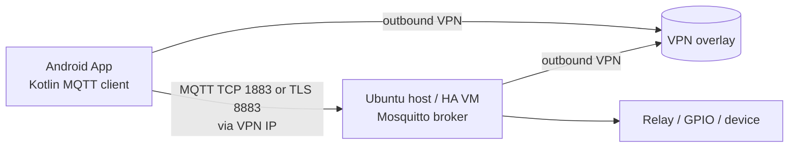
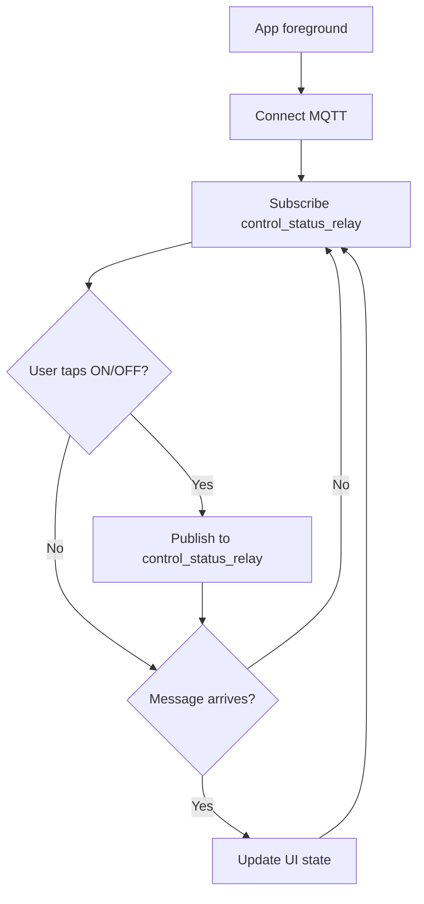

# Free Android Kotlin MQTT App on Ubuntu 24.04 for a Home Assistant Mosquitto Broker Behind 4G CGNAT

## Executive summary

You **do not need more than one MQTT broker** for your proof-of-concept (POC). A single Mosquitto broker “local to Home Assistant” is sufficient **if** your Android app can reach it over the Internet. The main obstacle is that a 4G mobile router commonly sits behind **carrier‑grade NAT (CGNAT)**, which typically prevents inbound connections/port‑forwarding from working reliably. citeturn9view0turn8search2

For a **free** and rigorous POC (Android app publishes “ON”/“OFF” and subscribes to status on `control_status_relay`), the most reliable topology under CGNAT is:

**Android phone ⇄ VPN overlay (Tailscale or WireGuard) ⇄ Home network ⇄ Mosquitto broker (on/near Home Assistant)**

This avoids exposing MQTT ports directly to the public Internet, works behind CGNAT, and keeps a single broker at the remote site. Home Assistant documentation explicitly recommends using a VPN (e.g., Tailscale) for secure remote access, and it warns CGNAT can block remote access unless you pay for a dedicated IPv4. citeturn9view0turn1search0turn1search4

On Ubuntu 24.04 LTS, you can develop the Android app with **Android Studio Panda 2 | 2025.3.2** (Stable) and build with **AGP 9.1 + JDK 17**. citeturn7search0turn7search11turn0search1turn0search5

## Assumptions

This report assumes the following (adjust where needed):

- The Home Assistant site has Internet via a **4G router** and likely **CGNAT** (no publicly routable IPv4). citeturn9view0turn8search2
- You want a **free** solution (no paid Home Assistant Cloud, no paid static IP). Home Assistant Cloud is a paid path, so it’s excluded. citeturn9view0
- Topic is exactly `control_status_relay` and payloads are exactly `"ON"` / `"OFF"` (both control and status).  
- You may run Home Assistant either:
  - as **Home Assistant OS** in a VM on Ubuntu (preferred if you want add-ons), or  
  - as **Home Assistant Container** on Ubuntu (no add-ons; Mosquitto must be separate). citeturn9view1turn4view0
- Android target device is a Galaxy A23 5G; on Linux, you’ll rely on ADB + udev rules (no OEM USB driver install like Windows). citeturn11view0turn6search0

## Topology options under CGNAT and recommended POC network flows

Home Assistant documentation highlights that remote access via port-forwarding can fail if your ISP uses CGNAT (often requiring a paid dedicated IPv4), and recommends VPN options such as entity["company","Tailscale","vpn mesh company"] for secure remote connectivity. citeturn9view0

### CGNAT detection (confirm the assumption)

CGNAT commonly uses the “shared address space” **100.64.0.0/10** reserved by RFC 6598. If your router’s “WAN IP” is 100.64.x.x–100.127.x.x, or your router WAN differs from what the Internet sees as your public IP, you are behind CGNAT. citeturn8search2turn8search12

On an Ubuntu host at the Home Assistant location (or any LAN host behind the 4G router), you can run:

```bash
# 1) What the Internet sees (public IPv4)
curl -4 ifconfig.me; echo

# 2) Your default gateway (likely the 4G router)
ip route | awk '/default/ {print}'

# 3) Traceroute can reveal 100.64/10 hops suggestive of CGNAT
sudo apt update
sudo apt install -y traceroute
PUBIP="$(curl -4 ifconfig.me)"
traceroute -n "$PUBIP" | head -n 20
```

Traceroute-based inference is a known CGNAT detection method; seeing 100.64/10 between your private gateway hop and your public IP is a strong indicator. citeturn8search12turn8search2

### Option comparison (what works behind a 4G CGNAT router)

**Direct port-forward to Mosquitto (NOT recommended; often impossible under CGNAT)**  
- Requires: public IPv4 on the router WAN + port forwarding to broker.  
- Home Assistant explicitly notes CGNAT can prevent remote access/port-forwarding without a dedicated IP. citeturn9view0  
- Security: risky if you expose MQTT 1883/8883 to the Internet.

**Cloud broker + bridge (possible, but violates “single local broker” and adds dependencies)**  
- Pattern: local Mosquitto bridges out to a public broker; phone connects to that public broker.  
- Still “free” only if you run your own public endpoint (usually requires a VPS/public IP).  
- Bridging is supported in Mosquitto configuration, but it introduces complexity and operational/security considerations. citeturn10search29turn12view0

**VPN overlay / mesh (recommended POC)**  
- Pattern: both phone and Home Assistant site make **outbound** connections to a VPN overlay, forming a reachable private network even behind CGNAT. Home Assistant explicitly lists VPNs like Tailscale as a secure remote access method. citeturn9view0turn1search0  
- No inbound port-forward needed.  
- Keeps **one broker** at the Home Assistant site.

### Recommended POC topology (single broker, works behind CGNAT)

Mermaid diagram (hub-and-spoke overlay VPN):



Why this is easiest for your constraints:

- CGNAT blocks inbound, but VPN overlay relies on outbound connectivity. citeturn9view0turn1search0  
- You keep exactly **one broker** (Mosquitto) local to the Home Assistant environment. citeturn3view0turn13search1

### Detailed network flows (recommended POC)

Assume:

- Broker runs on Home Assistant site at VPN IP `100.x.y.z` (Tailscale IP), TCP 1883 (or 8883 for TLS).
- Android connects to broker and subscribes/publishes.

**Connect + subscribe flow**
1. Android app starts, opens MQTT connection to `tcp://100.x.y.z:1883` (or `ssl://...:8883`).  
2. Broker authenticates (username/password). Mosquitto add-on requires auth; anonymous is not supported by that add-on. citeturn3view0  
3. App subscribes to `control_status_relay` (QoS 1 recommended for POC reliability).

**Control flow (ON/OFF)**
1. User taps ON → app publishes payload `"ON"` to `control_status_relay`.  
2. Broker distributes to all subscribers (including the app itself).  

**Status flow (every 10 seconds)**
1. Some automation/device publishes status to `control_status_relay` every 10 seconds (payload `"ON"` or `"OFF"`).  
2. App receives new message and updates UI.

Home Assistant supports time pattern triggers (including `/10` divisibility patterns, which you can apply to seconds) in automations. citeturn14view1

Mermaid lifecycle (app connect/publish/subscribe):



## Home Assistant and Mosquitto setup paths on Ubuntu 24.04

Home Assistant supports two major “on Linux” approaches: **Home Assistant OS** (recommended, supports add-ons) or **Home Assistant Container** (no add-ons; you manage everything). citeturn9view1turn4view0

### Path A (recommended if you want the Mosquitto add-on): Home Assistant OS VM on Ubuntu

Home Assistant’s Linux guide includes VM approaches (including KVM/virt workflows and example `virt-install` commands). citeturn4view0turn20search3

High-level steps:
1. Install a hypervisor (KVM/libvirt) on Ubuntu.
2. Create a VM using the Home Assistant OS qcow2 image.
3. Access Home Assistant at `http://<vm-ip>:8123`.
4. Install Mosquitto Broker “app/add-on” in Home Assistant.

Once Home Assistant OS is installed and accessible, you can install the Mosquitto broker add-on via: Settings → Apps → Install app → “Mosquitto broker”. citeturn3view0

#### Configure Mosquitto add-on credentials (Home Assistant OS)

The add-on documentation says:
- Create a **Home Assistant user** for MQTT (Settings → People → Users).
- The add-on can also create local `logins`, but using HA users is supported.
- It does **not** support anonymous logins. citeturn3view0

You should record:
- MQTT hostname/IP (LAN IP or VPN IP)
- Port: 1883 (MQTT), 1884 (WebSockets), 8883 (MQTT+TLS), 8884 (WebSockets+TLS)  
- Username/password citeturn3view0

#### TLS and WebSockets toggles (Home Assistant OS add-on)

The add-on docs specify:
- Without cert/key: unencrypted ports default to 1883 and 1884 (WebSockets).  
- With cert/key: encrypted ports default to 8883 and 8884 (WebSockets). citeturn3view0

If you want TLS:
- Place `fullchain.pem` and `privkey.pem` (or your chosen names) into Home Assistant’s `ssl` folder and configure `certfile`/`keyfile` in the add-on options. citeturn3view0  
- Then connect Android using `ssl://...:8883`.

### Path B (common on Ubuntu): Home Assistant Container + standalone Mosquitto

Home Assistant’s Linux docs provide the canonical Docker run command for **Home Assistant Container**, and they emphasize that this installation type **does not have access to apps/add-ons**. citeturn4view0

#### Install Docker Engine on Ubuntu 24.04 (not Docker Desktop)

Docker’s official docs confirm Ubuntu 24.04 (Noble) is supported for Docker Engine and show how to remove conflicting packages. citeturn1search3turn1search7

If you want the official apt repo method, follow Docker’s page precisely. citeturn1search3

#### Run Home Assistant Container

Home Assistant provides this baseline command (adjust `/PATH_TO_YOUR_CONFIG` and `TZ=`). citeturn4view0

```bash
docker run -d \
  --name homeassistant \
  --privileged \
  --restart=unless-stopped \
  -e TZ=Europe/Bucharest \
  -v /srv/homeassistant:/config \
  -v /run/dbus:/run/dbus:ro \
  --network=host \
  ghcr.io/home-assistant/home-assistant:stable
```

Then browse to:

```text
http://<ubuntu-host-ip>:8123
```

citeturn4view0

#### Install Mosquitto on Ubuntu (native service)

Ubuntu 24.04 packages Mosquitto in the 2.0.x series. citeturn7search3turn1search14

Install broker + CLI clients:

```bash
sudo apt update
sudo apt install -y mosquitto mosquitto-clients
```

The `mosquitto_sub` and `mosquitto_pub` CLI tools are documented as MQTT clients for subscribing/publishing. citeturn10search1turn10search2turn7search29

##### Create broker credentials (mosquitto_passwd)

Mosquitto supports a password file via `password_file`, and the official tool to manage it is `mosquitto_passwd`. citeturn10search3turn10search0

```bash
# Create password file with a first user
sudo mosquitto_passwd -c /etc/mosquitto/passwd mqttuser

# (Optional) add another user later:
sudo mosquitto_passwd /etc/mosquitto/passwd otheruser
```

Restart Mosquitto:

```bash
sudo systemctl restart mosquitto
sudo systemctl status mosquitto --no-pager
```

##### Mosquitto listener configuration (MQTT + optional WebSockets)

Mosquitto’s `listener` + `protocol` settings support `mqtt` and `websockets`. citeturn12view0

Create `/etc/mosquitto/conf.d/poc.conf`:

```conf
# /etc/mosquitto/conf.d/poc.conf

# Require authentication
allow_anonymous false
password_file /etc/mosquitto/passwd

# MQTT over TCP
listener 1883 0.0.0.0
protocol mqtt

# Optional: MQTT over WebSockets
listener 1884 0.0.0.0
protocol websockets

# Optional hardening if you have IPv6/WebSocket socket issues:
# socket_domain ipv4
```

Mosquitto documents `protocol websockets` and also notes IPv6/socket behavior can matter for websockets listeners (and `socket_domain` can force ipv4). citeturn12view0

Reload:

```bash
sudo systemctl restart mosquitto
```

#### Test from Ubuntu with mosquitto_pub/sub

Mosquitto documents `mosquitto_sub` and `mosquitto_pub` as subscribe/publish clients. citeturn10search1turn10search2

Terminal 1 (subscribe):

```bash
mosquitto_sub -h 127.0.0.1 -t 'control_status_relay' -v -u mqttuser -P 'YOUR_PASSWORD'
```

Terminal 2 (publish ON):

```bash
mosquitto_pub -h 127.0.0.1 -t 'control_status_relay' -m 'ON' -q 1 -u mqttuser -P 'YOUR_PASSWORD'
```

Terminal 2 (publish OFF):

```bash
mosquitto_pub -h 127.0.0.1 -t 'control_status_relay' -m 'OFF' -q 1 -u mqttuser -P 'YOUR_PASSWORD'
```

QoS/TLS options are described in the mosquitto_pub manual (including TLS enablement and port 8883 conventions). citeturn10search2

### Home Assistant automation for “status every 10 seconds”

If you want Home Assistant to publish status every 10 seconds, use a **time pattern trigger**; the docs state you can prefix with `/` for divisibility intervals. citeturn14view1

Home Assistant’s MQTT integration registers an `mqtt.publish` action with fields `topic`, `payload`, `qos`, `retain`. citeturn16view0

Example automation YAML concept (publish `"ON"` every 10 seconds if your relay is on, else `"OFF"`). You must adjust the entity `switch.my_relay` to your real relay entity:

```yaml
alias: "POC relay status publish"
mode: single
trigger:
  - platform: time_pattern
    seconds: "/10"
action:
  - action: mqtt.publish
    data:
      topic: "control_status_relay"
      qos: 1
      retain: false
      payload: >
        ONOFF
```

The `/10` time pattern behavior is documented, and the `mqtt.publish` action schema is documented (topic/payload/qos/retain). citeturn14view1turn16view0

## Ubuntu 24.04 Android development toolchain (free) with exact install steps

### Android Studio, AGP, JDK requirements (what matters in 2026)

- Android Studio stable as of March 3, 2026: **Android Studio Panda 2 | 2025.3.2**. citeturn7search0turn7search11  
- Android Gradle Plugin 9.1.0 (March 2026) lists compatibility including **JDK 17** and Gradle 9.3.1. citeturn0search1  
- Android docs explain you must match JDK to plugin requirements; they explicitly cite AGP 8.x needing JDK 17 and direct you to release notes for the minimum. citeturn0search5turn0search1

### Install OpenJDK 17 on Ubuntu 24.04

```bash
sudo apt update
sudo apt install -y openjdk-17-jdk
java -version
javac -version
```

Ubuntu’s developer documentation confirms OpenJDK 17 is available/certified on Ubuntu 24.04, and the package pattern is `openjdk-<version>-jdk`. citeturn6search18

### Install Android Studio on Ubuntu (manual tar.gz per official docs)

Android Developers’ install guide for Linux: unpack the `.tar.gz`, place in `/opt` if shared, and launch from `android-studio/bin/`. citeturn6search1turn0search0turn7search11

Example:

```bash
# 1) Download android-studio-panda2-linux.tar.gz from:
# https://developer.android.com/studio (Panda 2 | 2025.3.2 stable)

cd ~/Downloads
tar -xvzf android-studio-*-linux.tar.gz

# 2) Move to /opt (shared install)
sudo mv android-studio /opt/android-studio

# 3) Launch
/opt/android-studio/bin/studio.sh
```

The stable download is listed on the Android Studio page (Linux tar.gz) and the install steps are in the install docs. citeturn7search11turn6search1

### Android SDK / Platform-Tools (adb) / sdkmanager

- `adb` is documented by Android as the Android Debug Bridge tool. citeturn6search0  
- Platform-tools (including `adb` and `fastboot`) have official release notes and are typically installed by Android Studio. citeturn6search9turn7search2  
- `sdkmanager` is the official command-line SDK package manager. citeturn7search26

Practical approach:
- Install SDK components from Android Studio (SDK Manager).
- Verify:

```bash
# Typical default location after Studio:
~/Android/Sdk/platform-tools/adb version
```

### Git and optional VS Code

```bash
sudo apt update
sudo apt install -y git
git --version
```

VS Code is optional (Android Studio is sufficient).

### Mosquitto CLI clients on Ubuntu (for testing)

Home Assistant’s MQTT integration docs explicitly mention using `mosquitto_pub` and `mosquitto_sub` from the `mosquitto` broker package / `*-clients` package for testing MQTT. citeturn15search1

```bash
sudo apt update
sudo apt install -y mosquitto-clients
mosquitto_pub -h 127.0.0.1 -t test -m hello
```

### Python + paho-mqtt (optional test harness)

Eclipse Paho’s Python client can be installed from PyPI with `pip install paho-mqtt`. citeturn20search5turn20search0

On Ubuntu 24.04, set up a venv (recommended practice) and install:

```bash
sudo apt update
sudo apt install -y python3 python3-venv python3-pip

python3 -m venv ~/venvs/mqtt
source ~/venvs/mqtt/bin/activate
pip install --upgrade pip
pip install paho-mqtt
```

Paho Python implements MQTT 5.0/3.1.1/3.1 and is documented on PyPI and Eclipse’s page. citeturn20search0turn20search5

## Android app implementation in Kotlin (MQTT publish/subscribe)

### MQTT library options (Kotlin/Android)

Below is a comparison of three realistic choices you asked about.

| Library | License | MQTT versions | WebSockets | TLS | Android notes |
|---|---:|---:|---:|---:|---|
| Eclipse Paho Android Service | EPL/EDL | 3.1 / 3.1.1 | Yes | Yes | Android Service model; widely used |
| HiveMQ MQTT Client | Apache 2.0 | 3.1.1 + 5.0 | Via modules (varies) | Yes | Modern Java client; Android supported |
| Custom raw socket MQTT | Your choice | Up to you | Up to you | Up to you | Not recommended for POC complexity |

Sources for key assertions: Paho Android Service features list includes WebSocket and SSL/TLS support. citeturn17view2 HiveMQ MQTT Client repo states MQTT 5/3.1.1 compatibility and Apache 2.0 license, and their Android installation docs describe Android support. citeturn2search1turn2search5

**Recommendation for your POC:** Start with **Eclipse Paho Android Service** because it’s straightforward for a publish/subscribe UI POC and explicitly supports WebSockets, SSL/TLS, and “standard TCP.” citeturn17view2

### Android permissions and ADB/device connectivity on Ubuntu

Android’s “Run apps on a hardware device” page includes Ubuntu-specific instructions:
- add your user to `plugdev`
- install `android-sdk-platform-tools-common` for community udev rules citeturn11view0

```bash
sudo usermod -aG plugdev $LOGNAME
# log out and log back in
sudo apt-get install -y android-sdk-platform-tools-common
```

`adb` is the official command-line tool used to communicate with the device. citeturn6search0turn11view0

### Paho dependencies (Gradle)

The Paho repo shows you must include both:
- `org.eclipse.paho.client.mqttv3`
- `org.eclipse.paho.android.service` citeturn17view0

Use Maven Central versions for stability (example for Android Service 1.1.1 is listed by Sonatype). citeturn2search8turn2search32

`app/build.gradle.kts` (Kotlin DSL) example:

```kotlin
dependencies {
    implementation("org.eclipse.paho:org.eclipse.paho.client.mqttv3:1.2.5")
    implementation("org.eclipse.paho:org.eclipse.paho.android.service:1.1.1")
}
```

### AndroidManifest.xml (permissions + service)

The Paho sample manifest shows:
- `INTERNET`, `ACCESS_NETWORK_STATE`, `WAKE_LOCK`
- and declares `org.eclipse.paho.android.service.MqttService` as a `<service>` citeturn19view0

Minimal POC manifest snippet (add inside `<manifest>` / `<application>` appropriately):

```xml
<manifest ...>
    <uses-permission android:name="android.permission.INTERNET" />
    <uses-permission android:name="android.permission.ACCESS_NETWORK_STATE" />
    <uses-permission android:name="android.permission.WAKE_LOCK" />

    <application ...>
        <service android:name="org.eclipse.paho.android.service.MqttService" />
    </application>
</manifest>
```

### Cleartext vs TLS and Network Security Config

If you use MQTT over **TCP 1883** inside a VPN overlay, transport is still cleartext MQTT (but tunneled through VPN). If you use **WebSockets** over `ws://`, or you access any cleartext HTTP endpoints, you may need a network security config to permit cleartext. Android’s official Network Security Configuration docs show how to opt-in (and warn it’s insecure). citeturn2search6turn2search26

Example `res/xml/network_security_config.xml` (only if you truly need cleartext HTTP/WS):

```xml
<?xml version="1.0" encoding="utf-8"?>
<network-security-config>
    <base-config cleartextTrafficPermitted="true" />
</network-security-config>
```

And in `AndroidManifest.xml`:

```xml
<application
    android:networkSecurityConfig="@xml/network_security_config"
    ... >
</application>
```

Prefer TLS (`ssl://` to port 8883) when feasible, especially if you ever expose traffic beyond a trusted VPN. Mosquitto clients strongly recommend TLS for more than basic setups. citeturn10search2turn3view0

### Kotlin Paho code (connect, subscribe, publish ON/OFF)

This is a minimal, copy-paste-ready example using `MqttAndroidClient`.

**Key implementation notes for your constraints**
- Use a stable `clientId` per device (or generate once and persist).
- Subscribe to `control_status_relay` at startup.
- Publish `"ON"` / `"OFF"` on button taps.
- Use QoS 1 for better delivery assurance on mobile links.
- Be prepared for reconnects if the 4G link drops.

```kotlin
package com.example.mqttpoc

import android.content.Context
import android.util.Log
import org.eclipse.paho.android.service.MqttAndroidClient
import org.eclipse.paho.client.mqttv3.*

class MqttPocClient(
    private val context: Context,
    private val brokerUri: String,   // e.g. "tcp://100.x.y.z:1883" or "ssl://100.x.y.z:8883"
    private val username: String,
    private val password: String
) {
    companion object {
        private const val TAG = "MqttPocClient"
        private const val TOPIC = "control_status_relay"
        private const val QOS = 1
    }

    private val clientId = "android-poc-" + System.currentTimeMillis()
    private val client = MqttAndroidClient(context, brokerUri, clientId)

    fun connect(onStatus: (String) -> Unit, onConnected: () -> Unit, onError: (Throwable) -> Unit) {
        val opts = MqttConnectOptions().apply {
            isCleanSession = true
            isAutomaticReconnect = true
            userName = username
            password = this@MqttPocClient.password.toCharArray()
            keepAliveInterval = 30
            connectionTimeout = 10
        }

        client.setCallback(object : MqttCallbackExtended {
            override fun connectComplete(reconnect: Boolean, serverURI: String?) {
                Log.i(TAG, "connectComplete reconnect=$reconnect uri=$serverURI")
                try {
                    client.subscribe(TOPIC, QOS)
                    onConnected()
                } catch (e: Exception) {
                    onError(e)
                }
            }

            override fun connectionLost(cause: Throwable?) {
                Log.w(TAG, "connectionLost", cause)
            }

            override fun messageArrived(topic: String?, message: MqttMessage?) {
                val payload = message?.payload?.toString(Charsets.UTF_8) ?: return
                Log.i(TAG, "messageArrived topic=$topic qos=${message.qos} retained=${message.isRetained} payload=$payload")
                if (topic == TOPIC) onStatus(payload)
            }

            override fun deliveryComplete(token: IMqttDeliveryToken?) {
                Log.d(TAG, "deliveryComplete")
            }
        })

        client.connect(opts, null, object : IMqttActionListener {
            override fun onSuccess(asyncActionToken: IMqttToken?) {
                Log.i(TAG, "connect success")
                // subscribe happens in connectComplete
            }

            override fun onFailure(asyncActionToken: IMqttToken?, exception: Throwable?) {
                onError(exception ?: RuntimeException("Unknown MQTT connect failure"))
            }
        })
    }

    fun publishOn() = publish("ON")
    fun publishOff() = publish("OFF")

    private fun publish(payload: String) {
        if (!client.isConnected) {
            Log.w(TAG, "publish dropped, not connected")
            return
        }
        val msg = MqttMessage(payload.toByteArray(Charsets.UTF_8)).apply {
            qos = QOS
            isRetained = false
        }
        client.publish(TOPIC, msg)
    }

    fun disconnect() {
        if (!client.isConnected) return
        client.disconnect()
    }
}
```

### Foreground/background behavior (pragmatic POC guidance)

Android 8+ imposes **background execution limits**; long-running background services are restricted unless you run a foreground service with a visible notification. citeturn2search3turn2search19

For your POC, keep it simple and robust:
- **Connect only while the app is in the foreground** (Activity `onStart` → connect, `onStop` → disconnect).  
- This avoids fighting background limitations and reduces battery impact.

If you later need “always-on subscription” in the background, you’ll typically need a foreground service design (beyond POC scope), precisely because of these OS limits. citeturn2search3

## Build, sign, and install the APK from Ubuntu to Galaxy A23 5G

### Build from Android Studio or command line

Android’s official docs explain building from the command line using the Gradle wrapper (`./gradlew`). citeturn5search1turn5search12

From your project root:

```bash
./gradlew assembleDebug
```

The debug APK is typically under `app/build/outputs/apk/debug/`.

### ADB setup and device connection (Ubuntu)

Android’s hardware-device guide:
- describes using `adb devices`
- and Ubuntu prerequisites (plugdev group + udev rules package). citeturn11view0

Verify device is detected:

```bash
adb devices
```

### Install the APK (adb install)

Android’s `adb` documentation defines it as the tool to install/debug apps. citeturn6search0turn11view0

```bash
adb install -r app/build/outputs/apk/debug/app-debug.apk
```

### Release signing (for sideloading without Android Studio’s debug key)

Android Studio documents app signing concepts and steps; debug builds are signed automatically with a debug key, while release builds require signing. citeturn5search0turn5search11

For a pure POC, **debug signing is enough** for sideloading via `adb install`.

## Troubleshooting and validation checklist

### Connectivity and CGNAT issues

- If port-forwarding “should work” but doesn’t, re-check if your ISP is using CGNAT; Home Assistant explicitly calls this out as a common cause preventing remote access unless you get a dedicated IP. citeturn9view0  
- If you see 100.64.0.0/10 on the WAN side, that’s the RFC6598 shared space used for CGNAT. citeturn8search2

### VPN overlay pitfalls (Tailscale specifics)

- Tailscale has documented **CGNAT conflicts** if your ISP uses the same 100.64.0.0/10 range, potentially causing routing conflicts. citeturn8search27turn8search2  
- If you hit this, you may need to adjust routing/disable IPv4 routes in the overlay per vendor guidance.

### Tailscale setup (Ubuntu host)

Install steps and basic commands are in Tailscale docs/download page. citeturn1search0turn1search4turn1search18

```bash
# Option 1: official repo method (recommended for updates) - see Tailscale stable packages page for noble.
# Option 2: simple installer:
curl -fsSL https://tailscale.com/install.sh | sh

sudo tailscale up
tailscale ip -4
tailscale status
```

### Mosquitto logs

If Mosquitto is installed as a system service on Ubuntu:

```bash
sudo journalctl -u mosquitto -n 200 --no-pager
```

If Mosquitto runs in a container:

```bash
docker logs --tail 200 -f mosquitto
```

### Home Assistant logs

If Home Assistant runs as Docker container:

```bash
docker logs --tail 200 -f homeassistant
```

### Android logs (logcat)

When debugging MQTT connect/publish logic:

```bash
adb logcat | grep -i mqtt
```

### Two tables you can use as your “POC runbook”

**Library decision checkpoint (high-level)**  
Use Paho first; move to HiveMQ client later if you want MQTT 5 features and a more modern API. Paho’s repo enumerates its Android features (including TLS, WebSockets). citeturn17view2 HiveMQ’s repo/docs enumerate license and Android support. citeturn2search1turn2search5

**Step checklist with commands and expected outputs**

| Step | Command | Expected output / pass condition |
|---|---|---|
| Verify JDK | `java -version` | shows Java 17 |
| Build debug APK | `./gradlew assembleDebug` | BUILD SUCCESSFUL |
| Phone visible to adb | `adb devices` | device listed (not “unauthorized”) |
| Broker reachable (from phone network via VPN) | `mosquitto_sub ...` (from a host in same VPN) | receives messages |
| Publish ON/OFF | `mosquitto_pub ... -m ON` | subscriber prints `ON` |
| HA 10s status publish | (automation enabled) | subscriber sees updates every ~10s |

### Minimal Bill of Materials (free software only)

- Ubuntu 24.04 LTS dev machine  
- Android Studio Panda 2 | 2025.3.2 citeturn7search0turn7search11  
- OpenJDK 17 (AGP requirement) citeturn0search1turn0search5turn6search18  
- Android SDK Platform-Tools (`adb`) citeturn6search9turn6search0  
- Mosquitto broker + mosquitto-clients citeturn10search1turn10search2turn7search29turn7search3  
- One broker deployment:
  - Mosquitto add-on (if HA OS) citeturn3view0  
  - or native Mosquitto on Ubuntu (if HA Container) citeturn4view0turn10search3  
- VPN overlay:
  - Tailscale (free personal plan; note it’s a managed coordination service) citeturn9view0turn1search0turn1search4  
- Eclipse Paho Android Service library citeturn17view2turn2search32  

If you want, I can also provide a “strict single-topic” Home Assistant relay script pattern that avoids feedback loops (because MQTT 3.1.1 clients typically receive their own publishes when subscribed to the same topic), while still keeping your payload exactly `"ON"` / `"OFF"`.

## Addendum (2026-03-10): Recomandare Docker pe structura ta de directoare

Întrebare: **Docker pentru tot proiectul** sau **doar pentru anumite directoare**?

Verdict practic pentru setup-ul tău: **Docker parțial (hibrid), nu 100% Docker**.

Motivul principal: ai componente care sunt legate direct de host/hardware/rețea (ADB USB, Home Assistant OS VM, VPN overlay, udev/routing) și devin mai fragile dacă forțezi containerizare totală.

### Decizie pe directoare

| Director | Docker recomandat? | Recomandare concretă |
|---|---|---|
| `01_haos_vm_mosquitto_addon` | **NU** | Rulează Home Assistant OS în VM + addon Mosquitto (modelul nativ HAOS). Nu încerca să “dublezi” cu Docker aici. |
| `02_ha_container_mosquitto_native` | **DA, parțial** | Home Assistant în Docker (`homeassistant` container) este ok; Mosquitto poate rămâne nativ pe Ubuntu pentru simplitate și debugging ușor. |
| `03_android_kotlin_mqtt_app` | **NU (runtime/dev)** | Android build + ADB pe host. Docker pentru Android aici complică USB/ADB, emulator, permisiuni și viteza de build incremental. |
| `04_vpn_tailscale_overlay` | **NU** | Ține Tailscale pe host/OS (sau router), nu în container, pentru routing stabil și management clar al interfețelor. |
| `05_home_assistant_automation_status` | **NU** | E logică de automatizare/config HA, nu workload care cere container separat. Versionare în fișiere + backup. |
| `06_testing_validation_runbook` | **DA, opțional** | Bun candidat pentru Docker în CI (teste reproducibile). Local poți rula și în venv (mai simplu pentru iterații rapide). |
| `Repo_Alarma_CS` | **NU** | Repo de coordonare/documentație; fără nevoie reală de containerizare. |

### Arhitectură recomandată (stabilă pentru POC + exploatare)

1. **Host/VM layer (fără Docker):**
   - `01` (HAOS VM + addon) **sau** `02` (HA container + Mosquitto nativ)
   - `03` Android/ADB
   - `04` VPN overlay
   - `05` automatizări HA
2. **Docker layer (doar unde aduce valoare):**
   - opțional în `02` pentru Home Assistant Container
   - opțional în `06` pentru teste/CI reproductibile

### Când merită Docker “mai mult” în proiectul tău

Folosește mai mult Docker doar dacă urmărești explicit:
- pipeline CI/CD strict reproducibil,
- onboarding rapid pentru mai mulți dezvoltatori,
- separare strictă a dependențelor Python/test.

### Când să eviți Docker total

Evită 100% Docker dacă prioritatea este:
- debugging rapid pe mobil prin ADB,
- rețea VPN/CGNAT cât mai predictibilă,
- operare simplă la fața locului (home lab).

### Concluzie finală

Pentru structura ta actuală, **cea mai bună strategie este Docker pe părțile de infrastructură/test care beneficiază direct de izolare (`02` parțial, `06` opțional), iar restul să rămână nativ**.

Această abordare îți dă echilibrul corect între:
- stabilitate operațională,
- viteză de dezvoltare,
- complexitate minimă în producție/home-lab.
